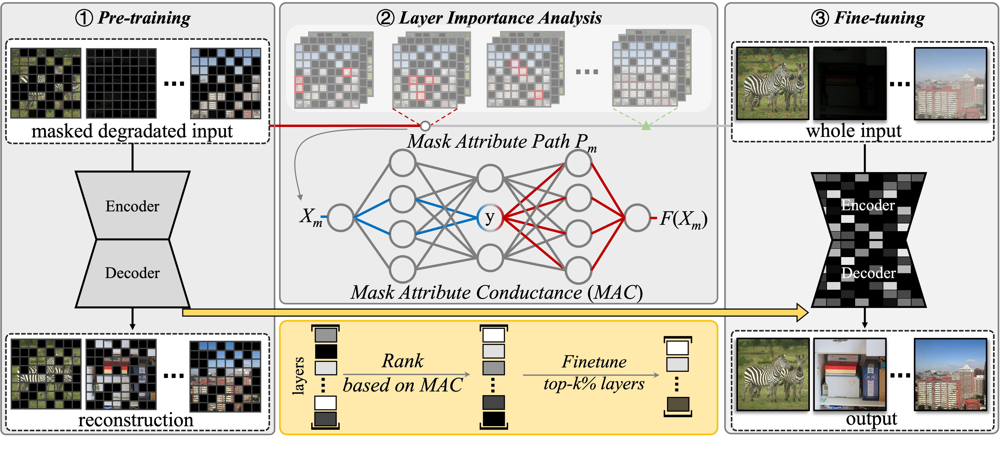

# <p align=center> :fire: `Restore Anything with Masks：Leveraging Mask Image Modeling for Blind All-in-One Image Restoration (ECCV2024)`</p>
## <div align="center"><a href="">Homepage(TBD)</a> | <a href="https://arxiv.org/abs/2409.19403v1">Paper</a> | <a href="">Google Drive(TBD)</a> | <a href="">Baidu Cloud(TBD)</a>

This is the official PyTorch codes for the paper.  
>**Restore Anything with Masks：Leveraging Mask Image Modeling for Blind All-in-One Image Restoration**<br>  [Chujie Qin](https://github.com/Dragonisss), [Ruiqi Wu](https://rq-wu.github.io/), [Zikun Liu](), [Xin Lin](https://linxin0.github.io/), [Chunle Guo](https://scholar.google.com/citations?user=RZLYwR0AAAAJ&hl=en), [Hyun Hee Park](s), [Chongyi Li<sup>*</sup>](https://li-chongyi.github.io/) （ * indicates corresponding author)<br>
> European Conference on Computer Vision (ECCV), 2024



### :rocket: Highlights:
- RAM is a Blind All-In-One Image Restoration framework that can simultaneously handle <b style='font-size: large'>7 Restoration Tasks</b>  and achieve <b style='font-size: large'>SOTA performance</b> !
- RAM focus on tackling how to extract <b style='font-size: large'>Image Prior</b> instead of degradation prior from diverse corrupted images by Leveraging <b style='font-size: large'>Mask Image Modeling</b>.

## :wrench: Dependencies and Installation
1. Clone and enter our repository:
    ```bash
   git clone https://github.com/Dragonisss/RAM.git RAM
   cd RAM
    ```
2. Simply run the `install.sh` for installation!
    ```sh
    source install.sh
    ```
3. Activate the environment whenever you test!
    ```bash
    conda activate RAM
    ```
## :sparkles: Datasets and Pretrained Models
> Given the number of datasets involved, we plan to offer a unified download link in the future to make it easier to access all datasets.

We combine datasets from various restoration tasks to form the training set. Here are the relevant links for all the datasets used:
<table>
<thead>
  <tr>
    <th> Dataset </th>
    <th> Phase </th>
    <th> Source </th>
    <th> Task for</th>
    <th> Conf. </th>
  </tr>
</thead>
<tbody>
  <tr>
    <td>OTS_ALPHA </td>
    <th>Train </th>
    <th> [<a href=https://pan.baidu.com/s/1wBE9wh9nXkvcJ6763CX1TA>Baidu Cloud(f1zz)</a>]</th>
    <th> Dehaze </th>
    <th> CVPR 2018 </th>
  </tr>
  <tr>
    <td> Rain-13k </td>
    <th> Train & Test </th>
    <th>[<a href='https://drive.google.com/drive/folders/1Hnnlc5kI0v9_BtfMytC2LR5VpLAFZtVe'>Google Drive</a>] </th>
    <th> Derain </th>
    <th> CVPR 2018 </th>
  </tr>
  <tr>
    <td> LOL-v2 </td>
    <th> Train & Test </th>
    <th> [Real Subset <a href=https://pan.baidu.com/share/init?surl=pQW7zq4yqU1zMRrlotxkXg>Baidu Cloud(65ay)</a>] / [Synthetic Subset <a href=https://pan.baidu.com/share/init?surl=t5OYgDgk3mQO53OXqW7QEA>Baidu Cloud(b14u)</a>] </th>
    <th> Low Light Enhancement </th>
    <th> CVPR 2018 </th>
  </tr>
  <tr>
    <td> GoPro </td>
    <th> Train & Test </th>
    <th> [<a href=https://drive.google.com/file/d/1y4wvPdOG3mojpFCHTqLgriexhbjoWVkK/view?usp=sharing>Download</a>] </th>
    <th> Motion Deblur </th>
    <th> CVPR 2018 </th>
  </tr>
    <tr>
    <td> LSDIR </td>
    <th> Train & Test </th>
    <th> [<a href=https://data.vision.ee.ethz.ch/yawli/index.html>HomePage</a>] </th>
    <th> Denoise DeJPEG DeBlur </th>
    <th> CVPR 2018 </th>
  </tr>
  </tr>
    <tr>
    <td> SOTS </td>
    <th> Test </th>
    <th> [<a href="https://www.kaggle.com/datasets/balraj98/synthetic-objective-testing-set-sots-reside?resource=download"l>Download</a>] </th>
    <th> Denoise DeJPEG DeBlur </th>
    <th> CVPR 2018 </th>
  </tr>
  </tr>
    <tr>
    <td> CBSD68 </td>
    <th> Test </th>
    <th> [<a href="https://github.com/clausmichele/CBSD68-dataset/tree/master"l>Download</a>] </th>
    <th> Denoise</th>
    <th> CVPR 2018 </th>
  </tr>
</tbody>
</table>
You need to collect required datasets above and place them under the `./datasets` Directory.

**Symbolic links** is a recommended approach, allowing you to place the datasets anywhere you prefer!

The final directory structure will be arranged as:
```
datasets
    |- CBSD68
        |- CBSD68
          |- noisy5
          |- noisy10
          |- ...
    |- gopro
        |- test
        |- train
    |- LOL-v2
        |- Real_captured
        |- Synthetic
    |- LSDIR
        |- 0001000
        |- 0002000
        |- ...
    |- OTS_ALPHA
        |- clear
        |- depth
        |- haze
    |- LSDIR-val
        |- 0000001.png
        |- 0000002.png
        |- ...
    |- rain13k
        |- test
        |- train
    |- SOTS
        |- outdoor
```

Our pipeline can be applied to any image restoration network. We provide the pre-trained and fine-tuned model files for SwinIR and PromptIR mentioned in the paper:
<table>
<thead>
  <tr>
    <th> Method </th>
    <th> Phase </th>
    <th> Framework </th>
    <th> Download Links </th>
    <th> Config File </th>
  </tr>
</thead>
<tbody>
  <tr>
    <td>RAM </td>
    <th> Pretrain </th>
    <th> SwinIR </th>
    <th> [<a href="">GoogleDrive(TBD)</a>] </th>
    <th> [<a href="options/RAM_SwinIR/ram_swinir_pretrain.yaml">options/RAM_SwinIR/ram_swinir_pretrain.yaml</a>] </th>
  </tr>
   <tr>
    <td>RAM </td>
    <th> Finetune </th>
    <th> SwinIR </th>
    <th> [<a href="">GoogleDrive(TBD)</a>] </th>
    <th> [<a href="options/RAM_SwinIR/ram_swinir_finetune.yaml">options/RAM_SwinIR/ram_swinir_finetune.yaml</a>] </th>
  </tr>
    <tr>
    <td>RAM </td>
    <th> Pretrain </th>
    <th> PromptIR </th>
    <th> [<a href="">GoogleDrive(TBD)</a>] </th>
    <th> [<a href="options/RAM_PromptIR/ram_promptir_pretrain.yaml">options/RAM_PromptIR/ram_promptir_pretrain.yaml</a>] </th>
  </tr>
    <tr>
    <td>RAM </td>
    <th> Finetune </th>
    <th> PromptIR </th>
    <th> [<a href="">GoogleDrive(TBD)</a>] </th>
    <th> [<a href="options/RAM_PromptIR/ram_promptir_finetune.yaml">options/RAM_PromptIR/ram_promptir_finetune.yaml</a>] </th>
  </tr>
</tbody>
</table>

## :camera: Quick Demo
We provide scripts for inference your own images in [inference/inference.py](inference/inference.py). <br/>
You could run `python inference/inference.py --help` to get detailed information of this scripts.

## :robot: Training RAM From Scratch!
Before proceeding, please **ensure** that the relevant datasets have been prepared as required.

**1.Pretraining with MIM**
We use the collected datasets for model training. First, we execute the following command:
```python
python -m torch.distributed.launch \
--nproc_per_node=[num of gpus] \
--master_port=[PORT] ram/train.py \
-opt [OPT] \
--launcher pytorch

# e.g.
python -m torch.distributed.launch \
--nproc_per_node=8 \
--master_port=4321 ram/train.py \
-opt options/RAM_SwinIR/ram_swinir_pretrain.yaml \
--launcher pytorch
```

**2.Mask Attribute Conductance Analysis**

We use proposed Mask Attribute Conductance Analysis to analyze the importance of different layers for finetuning. You can run the following command to conduct MAC analysis:
```python
python scripts/mac_analysis.py -opt [OPT] --launcher pytorch

# e.g.
python scripts/mac_analysis.py \
-opt options/RAM_SwinIR/ram_swinir_mac.yml --launcher pytorch

```
For convenience, we have provided the analysis results of the two models, RAM-SwinIR and RAM-PromptIR, mentioned in the paper. You can find them in [./mac_analysis_result/](./mac_analysis_result/)

**3.Finetuning**
```python
python -m torch.distributed.launch --nproc_per_node=<num of gpus> --master_port=4321 ram/train.py \
-opt [OPT] --launcher pytorch
```
You can also add `CUDA_DEVICE_VISIBLE=` to choose gpu you want to use.


## :chart_with_upwards_trend: Evaluation 
We have provided a script for fast evaluation:
```python
python -m torch.distributed.launch \
--nproc_per_node=1 \
--master_port=[PORT] ram/test.py \
-opt [OPT] --launcher pytorch
```
To benchmark the performance of RAM on the test dataset, you can run the following command:
```python
# RAM-SwinIR
python -m torch.distributed.launch \
--nproc_per_node=1 \
--master_port=4321 ram/test.py \
-opt options/test/ram_swinir_benchmark.yml --launcher pytorch

# RAM-PromptIR
python -m torch.distributed.launch \
--nproc_per_node=1 \
--master_port=4321 ram/test.py \
-opt options/test/ram_promptir_benchmark.yml --launcher pytorch
```
## :book: Citation

If you find our repo useful for your research, please consider citing our paper:

```bibtex
@misc{qin2024restoremasksleveragingmask,
      title={Restore Anything with Masks: Leveraging Mask Image Modeling for Blind All-in-One Image Restoration}, 
      author={Chu-Jie Qin and Rui-Qi Wu and Zikun Liu and Xin Lin and Chun-Le Guo and Hyun Hee Park and Chongyi Li},
      year={2024},
      eprint={2409.19403},
      archivePrefix={arXiv},
      primaryClass={cs.CV},
      url={https://arxiv.org/abs/2409.19403}, 
}
```

## :postbox: Contact

For technical questions, please contact `chujie.qin[AT]mail.nankai.edu.cn`